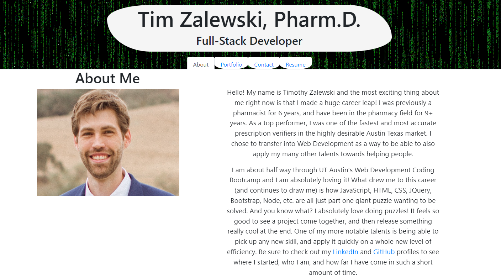

# Portfolio - React

## Description
A front-end show case displaying Tim Zalewski's portfolio using React     

 ## Table of Contents:

  **[How to Use](#how-to-use)**  
  **[Application Demos](#application-demos)**  
  **[Link to Deployed Page](#link-to-deployed-page)**  
  **[References](#references)**  
  **[Devlopment Process](#development-process)**  
  **[Author](#author)**  

## How to Use:
* Use the links to naviagate through the pages, and enjoy yourself!

## Application Demos:
<h2 align="center">About Me</h2>

   
<h2 align="center">Portfolio</h2>

  
<h2 align="center">Contact Form</h2>

  
<h2 align="center">Resume Section</h2>

  

<a href="https://drive.google.com/file/d/1mLjXeAkKqRFDjM1MrK35keyXzzyR6wAf/view">Video Demo</a>

## Link to Deployed Page:
https://tim-zebra.github.io/React-Portfolio/

## References:
* Starter code inspired by UTA bootcamp course #20 React  
* Contact form inspired by Aleksandr Varnin at https://mailtrap.io/blog/react-contact-form/  
* Github icon inspired by https://www.flaticon.com/free-icon/github-logo_25231  
* LinkedIn icon inspired by https://flyclipart.com/linkedin-ui-flat-set-of-icons-icons-for-free-linkedin-icon-png-930862  
* StackOverFlow icon inspired by https://commons.wikimedia.org/wiki/File:Stack_Overflow_icon.svg  
* Header gif inspired by Bruce Peacecraft at https://www.pinterest.com/pin/509188301610937530/  
* Background gradient inspired by Manuel Pinto at https://codepen.io/P1N2O/pen/pyBNzX  
* Regex email validate inspired by Rahul Bansal at https://www.tutorialspoint.com/regex-in-reactjs  

## Development Process:
1. Created base files  
2. Added pseudocode and pseudofiles based on acceptance criteria  
3. Outlined task completion order  
4. Compeleted loading/functional components  
5. Created space holders with basic CSS for header/footer/section  
6. Slowly added functionality throughout  
7. Finalized content  
8. Finalized layout  
9. Finalized animations/css  
3. See commits for more details

## Author:
Created by Timothy Zalewski | Deployed on [GitHub](https://github.com/Tim-Zebra)